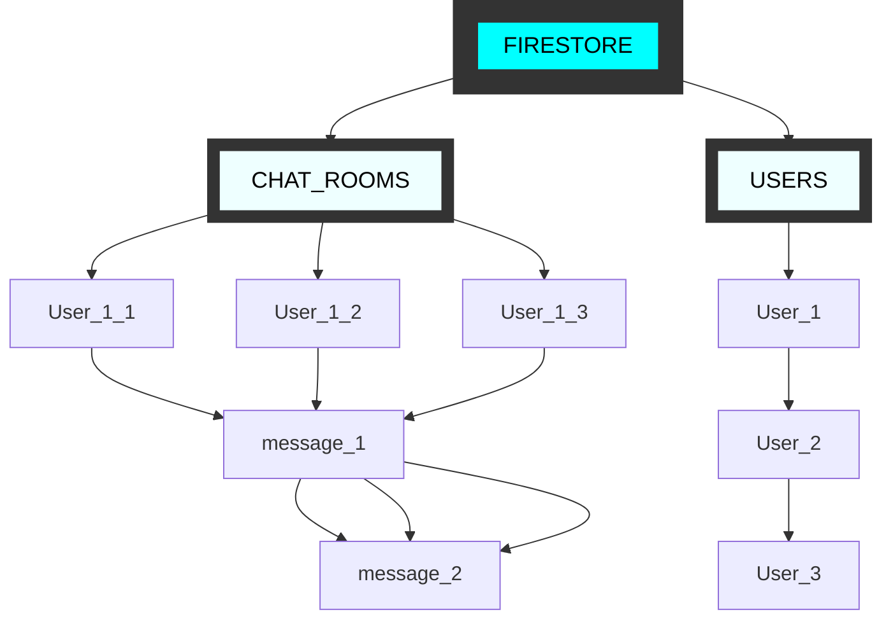

# Talksy
Talksy is a fast and secure chat application built using Flutter and Firebase, offering seamless real-time messaging with a modern and intuitive interface

## Roles and Interactions Flowchart

This flowchart demonstrates the key roles (User, Seller, and Admin) and their interactions within platform.

