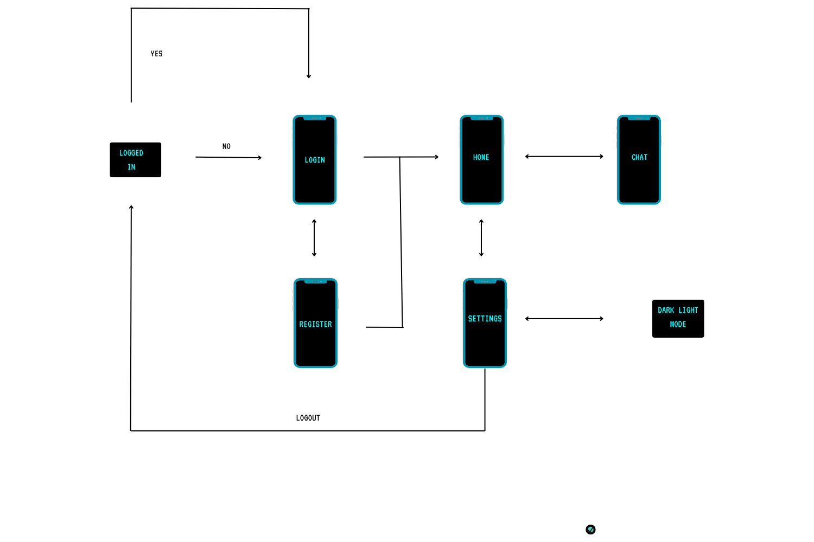
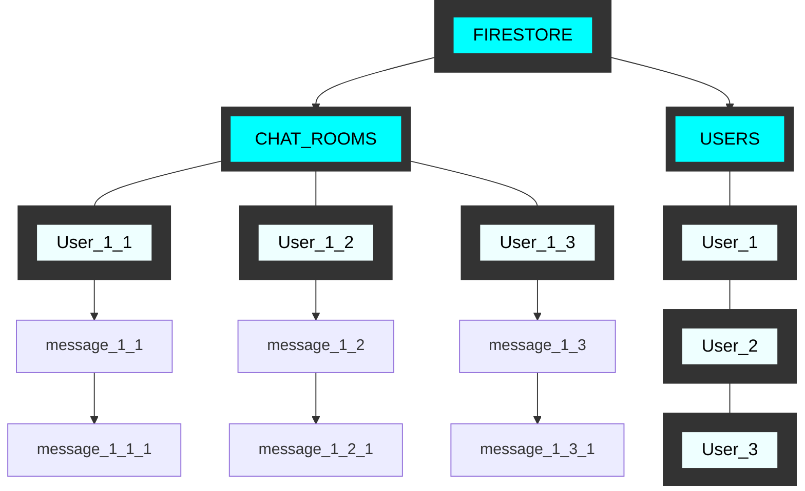

# Talksy
Talksy is a fast and secure chat application built using Flutter and Firebase, offering seamless real-time messaging with a modern and intuitive interface

## Workflow

## Roles and Interactions Flowchart

This flowchart demonstrates the key roles and their interactions within platform.

| Themes  | Auth           | Chat Functionality| User Account Functionality|Clean Up|DeviceSpecific|
|---------|--------------|----------------|-----------------------|----------------|---------------|
| Light   | Email Login  |Send Message|Block User|UI|Receive Notifications|
| Dark    | Email Register |Receive Message|Delete User|Unread Messages|RealTime|
